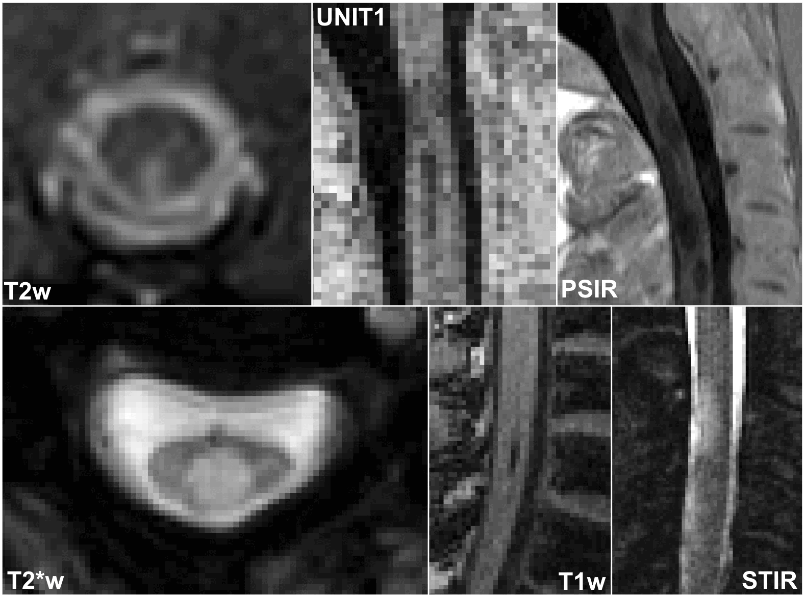

# Segmentation of spinal cord multiple sclerosis lesions

## Robust Spinal Cord MS Lesion Segmentation Across Diverse MRI Protocols and Centers

TODO: when published: add icon similar to this one (https://github.com/sct-pipeline/contrast-agnostic-softseg-spinalcord/blob/bfcb8352aa2cdbcb356e428181fbc3dbd2fa42ef/README.md?plain=1#L3)



Official repository for the segmentation of multiple sclerosis (MS) spinal cord (SC) lesions.

This repo contains all the code for training the SC MS lesion segmentation model. The code for training is based on the nnUNetv2 framework. The segmentation model is available as part of [Spinal Cord Toolbox (SCT)](https://spinalcordtoolbox.com/stable/index.html) via the sct_deepseg functionality.

### Citation Information

If you find this work and/or code useful for your research, please cite our paper:

```
TODO: when published, add citation.
```

### Annotators

Below is a list of certified radiologists who have helped label lesion segmentation.

- Laurent Létourneau-Guillon
- David Araujo
- Lydia Chougar
- Dumitru Fetco
- Masaaki Hori
- Kouhei Kamiya
- Steven Messina
- Charidimos Tsagkas

### Code description

The repository contains all the code for the SC MS lesion segmentation project:
- `compute_canada_scripts`: code used to train the model on compute canada
- `dataset_aggregation`: code used to aggregate all the data
- `dataset_analysis`: code used to analyze the data
- `evaluation`: code used to evaluate the performance of the model
- `nnunet`: code used for training with nnunet
- `post-processing`: code used for post-processing

